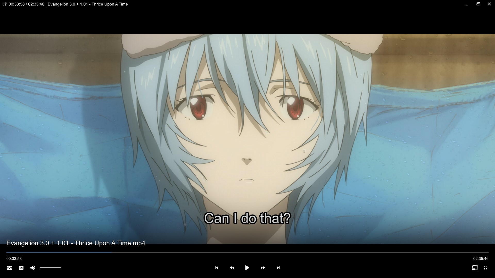

# ModernX
>
> [!IMPORTANT]
> This script is updated most frequently at [mpvconfig](https://github.com/zydezu/mpvconfig), stable builds are released here in the [releases](https://github.com/zydezu/ModernX/releases) tab.

A fork of mpvX (based on [mpv-osc-modern](https://github.com/maoiscat/mpv-osc-modern/)), that aims to mirror the functionality of MPV's stock OSC while with a more modern-looking interface.



> [!NOTE]
> This script is included in my [mpvconfig](https://github.com/zydezu/mpvconfig), check that repository for a full mpv configuration

## Additional Features

This fork changes the following:

- Adds compact mode and reorganises some features
- Added loop and pin window buttons
- Adds a download button for web videos
- Displays descriptions, likes and dislike counts from web videos
- Added shift+left clicking and shift+right clicking the audio/subtitles button for a list of tracks are shown and traversed through
- Pressing TAB shows a list of chapters
- Added dynamic title changing depending on the file/source being played
- Many more configurable options
- Various bug fixes

## Installation

Locate your MPV folder. It is typically located at `\%APPDATA%\mpv\` on Windows and `~/.config/mpv/` on Linux/MacOS. See the [Files section](https://mpv.io/manual/master/#files) in mpv's manual for more info.

> [!NOTE]
> Create these folders if you don't have them already

Place `modernx.lua` into your mpv `scripts/` folder, remove any previous OSC scripts.

Then place the font in the `fonts/` folder. [fluent-system-icons.ttf](fluent-system-icons.ttf) (click the link to download).

### mpv.conf

Add the following lines to your `mpv.conf` file.

> [!NOTE]
> Please note that `.conf` files use yes/no in place of true/false

```editorconfig
osc=no
border=no #optional - if you don't want to see the OS border
```

### Border differences

This is what disabling and enabling the border looks like:

| Border Enabled | Border Disabled |
| -------------- | --------------- |
|  |  |

> [!NOTE]
> This option may vary depending on your system.

## Configuration

Create an `modernx.conf` file and place it in the `script-opts/` folder (create the folder if you haven't already). A plethora of options can be changed, so please refer to the table of configurable `user_opts` parameters below for detailed explanations of settings.

### Example

Here is an example of a configuration file, which would be placed in `script-opts/modernx.conf`:

```editorconfig
compactmode=no
showinfo=yes
titlefontsize=20
seekbarhandlesize=0
```

### Configurable Options

The default options are shown below:

```lua
local user_opts = {
    -- Language and display --
    language = "en",                        -- en:English - .json translations need implementing
    font = "mpv-osd-symbols",               -- font for the OSC (default: mpv-osd-symbols or the one set in mpv.conf)

    idlescreen = true,                      -- show mpv logo when idle
    window_top_bar = "auto",                -- show OSC window top bar: "auto", "yes", or "no" (borderless/fullscreen)
    showwindowed = true,                    -- show OSC when windowed
    showfullscreen = true,                  -- show OSC when fullscreen
    showonpause = true,                     -- show OSC when paused
    keeponpause = false,                    -- disable OSC hide timeout when paused
    greenandgrumpy = false,                 -- disable Santa hat in December
    visibility = "auto",                    -- only used at init to set visibility_mode(...)

    -- OSC behaviour and scaling
    hidetimeout = 1500,                     -- time (in ms) before OSC hides if no mouse movement
    seek_resets_hidetimeout = true,         -- if seeking should reset the hidetimeout
    fadeduration = 150,                     -- fade-out duration (in ms), set to 0 for no fade
    minmousemove = 0,                       -- minimum mouse movement (in pixels) required to show OSC
    bottomhover = true,                     -- show OSC only when hovering at the bottom
    bottomhover_zone = 200,                 -- height of hover zone for bottomhover (in pixels)
    osc_on_seek = false,                    -- show OSC when seeking
    mouse_seek_pause = true,                -- pause video while seeking with mouse move (on button hold)

    vidscale = false,                       -- scale osc with the video
    scalewindowed = 1.0,                    -- osc scale factor when windowed
    scalefullscreen = 1.0,                  -- osc scale factor when fullscreen
    scaleforcedwindow = 1.0,                -- osc scale factor when forced (no video, like music files)

    -- Time, title and description display
    show_title = true,                      -- show title in the OSC (above seekbar)
    title = "${media-title}",               -- title above seekbar format: "${media-title}" or "${filename}"
    title_font_size = 28,                   -- font size of the title text (above seekbar)
    dynamic_title = true,                   -- change title if {media-title} and {filename} differ (eg: when playing URLs or audio)

    show_chapter_title = true,              -- show chapter title alongside timestamp (below seekbar)
    chapter_fmt = "%s",                     -- format for chapter display on seekbar hover (set to "no" to disable)

    timetotal = true,                       -- show total time instead of remaining time
    timems = false,                         -- show timecodes with milliseconds
    unicodeminus = false,                   -- use the Unicode minus sign in remaining time
    time_format = "dynamic",                -- "dynamic" or "fixed" - dynamic shows MM:SS when possible, fixed always shows HH:MM:SS
    time_font_size = 18,                    -- font size of the time display

    show_description = true,                -- show video description on web videos
    show_file_size = true,                  -- show the current file's size in the description
    description_font_size = 19,             -- font size of the description text (below title)
    description_alpha = 100,                -- alpha of the description background box

    date_format = "%Y-%m-%d",               -- how dates should be formatted, when read from metadata (uses standard lua date formatting)

    -- Title bar settings
    window_title = true,                    -- show window title in borderless/fullscreen mode
    window_controls = true,                 -- show window controls (close, minimize, maximize) in borderless/fullscreen
    title_bar_box = false,                  -- show title bar as a box instead of a black fade
    windowcontrols_title = "${media-title}",-- same as title but for window_controls

    -- Subtitle display settings
    raise_subtitles = true,                 -- whether to raise subtitles above the osc when it's shown
    raise_subtitle_amount = 175,            -- how much subtitles rise when the osc is shown

    -- Buttons display and functionality
    compactmode = true,                     -- replace the jump buttons with the seek/chapter buttons
    
    jump_buttons = true,                    -- show the jump backward and forward buttons
    jump_amount = 10,                       -- change the jump amount in seconds
    jump_more_amount = 60,                  -- change the jump amount in seconds when right-clicking jump buttons and shift-clicking chapter skip buttons
    jump_icon_number = true,                -- show different icon when jump_amount is set to 5, 10, or 30
    jump_mode = "relative",                 -- seek mode for jump buttons
    jump_softrepeat = true,                 -- enable continuous jumping when holding down seek buttons
    chapter_skip_buttons = true,            -- show the chapter skip backward and forward buttons
    chapter_softrepeat = false,             -- enable continuous skipping when holding down chapter skip buttons
    track_nextprev_buttons = true,          -- show next/previous playlist track buttons

    volume_control = true,                  -- show mute button and volume slider
    volume_control_type = "linear",         -- volume scale type: "linear" or "logarithmic"
    
    info_button = false,                    -- show info button
    ontop_button = true,                    -- show window on top button
    screenshot_button = false,              -- show screenshot button
    screenshot_flag = "subtitles",          -- flag for screenshot button: "subtitles", "video", "window", "each-frame" 
                                            -- https://mpv.io/manual/master/#command-interface-screenshot-%3Cflags%3E

    download_button = true,                 -- show download button on web videos (requires yt-dlp and ffmpeg)
    download_path = "~~desktop/mpv/downloads", -- default download directory for videos (https://mpv.io/manual/master/#paths)

    loop_button = false,                     -- show loop button

    loop_in_pause = true,                   -- enable looping by right-clicking pause

    playpause_size = 30,                    -- icon size for the play/pause button
    midbuttons_size = 24,                   -- icon size for the middle buttons
    sidebuttons_size = 24,                  -- icon size for the side buttons

    -- Colors and style
    osc_color = "#000000",                  -- accent color of the OSC and title bar
    window_title_color = "#FFFFFF",         -- color of the title in borderless/fullscreen mode
    window_controls_color = "#FFFFFF",      -- color of the window controls (close, minimize, maximize) in borderless/fullscreen mode
    windowcontrols_close_hover = "#E81123", -- color of close window control on hover
    windowcontrols_minmax_hover = "#53A4FC",-- color of min/max window controls on hover
    title_color = "#FFFFFF",                -- color of the title (above seekbar)
    seekbarfg_color = "#1D96F5",            -- color of the seekbar progress and handle, in Hex color format
    seekbarbg_color = "#FFFFFF",            -- color of the remaining seekbar, in Hex color format
    seekbar_cache_color = "#1D96F5",        -- color of the cache ranges on the seekbar
    volumebar_match_seek_color = false,     -- match volume bar color with seekbar color (ignores side_buttons_color)
    time_color = "#FFFFFF",                 -- color of the timestamps (below seekbar)
    chapter_title_color = "#FFFFFF",        -- color of the chapter title next to timestamp (below seekbar)
    side_buttons_color = "#FFFFFF",         -- color of the side buttons (audio, subtitles, playlist, etc.)
    middle_buttons_color = "#FFFFFF",       -- color of the middle buttons (skip, jump, chapter, etc.)
    playpause_color = "#FFFFFF",            -- color of the play/pause button
    held_element_color = "#999999",         -- color of the element when held down (pressed)
    hover_effect_color = "#FFFFFF",         -- color of a hovered button when hover_effect includes "color"
    thumbnail_border_color = "#FFFFFF",     -- color of the border for thumbnails (with thumbfast)

    fade_alpha = 150,                       -- alpha of the OSC background box
    fade_blur_strength = 100,               -- blur strength for the OSC alpha fade. caution: high values can take a lot of CPU time to render
    window_fade_alpha = 75,                 -- alpha of the window title bar
    thumbnail_border = 1,                   -- the width of the thumbnail border

    -- Button hover effects
    hover_effect = "size,glow,color",       -- active button hover effects: "glow", "size", "color"; can use multiple separated by commas
    hover_button_size = 115,                -- relative size of a hovered button if "size" effect is active
    button_glow_amount = 5,                 -- glow intensity when "glow" hover effect is active
    hover_effect_for_sliders = false,       -- apply hover effects to slider handles

    -- Progress bar settings
    seekbarhandlesize = 0.8,                -- size ratio of the seekbar handle (range: 0 ~ 1)
    seekrange = true,                       -- show seek range overlay
    seekrangealpha = 175,                   -- transparency of the seek range
    seekbarkeyframes = false,               -- use keyframes when dragging the seekbar
    
    automatickeyframemode = true,           -- automatically set keyframes for the seekbar based on video length
    automatickeyframelimit = 600,           -- videos longer than this (in seconds) will have keyframes on the seekbar

    persistentprogress = false,             -- always show a small progress line at the bottom of the screen
    persistentprogressheight = 17,          -- the height of the persistentprogress bar
    persistentbuffer = false,               -- on web videos, show the buffer on the persistent progress line
    persistentprogresstoggle = true,        -- enable toggling the persistentprogress bar

    -- Experimental
    title_youtube_stats = true,             -- update the window/OSC title bar with YouTube video stats (views, likes, dislikes)
    show_youtube_comments = false,          -- EXPERIMENTAL - not ready
    comments_download_path = "~~desktop/mpv/downloads/comments", -- the download path for the comment JSON file
    scrolling_speed = 40,                   -- the speed of scrolling text in menus
    ytdl_format = "",                       -- optional parameteres for yt-dlp downloading, eg: '-f bestvideo+bestaudio/best'
}
```

### Compact Mode

Compact mode is a setting you can enable in the configuration, it removes the skip buttons, and places that functionality within the chapter buttons, allowing for more space in the interface. Clicking the buttons will act as jumping, and shift clicking will act as skipping a chapter

| Compact Mode Enabled | Compact Mode Disabled |
| -------------- | --------------- |
|  |  |

> [!IMPORTANT]
> This changes the actions of the chapter back/forward buttons in the following way:
>
> - `Left mouse button` jumps forwards/backwards by 5 seconds, or by the amount set in `user_opts`
> - `Right mouse button` play previous/next chapter and show the chapter list
> - `Shift + Left mouse button` jumps forwards/backwards by 1 minute
> - `Shift + Right mouse button` show playlist
> Please note that this option will override the `showjump` option.

### Thumbnails

To enable thumbnails on the seekbar, install [thumbfast](https://github.com/po5/thumbfast). No other step necessary.


## Buttons

Like the built-in script, some buttons may accept multiple mouse actions, here is a list:

> [!NOTE]
> Middle clicking performs the same function as `Shift+left mouse button`, allowing for one handed use

### Title

- `Left mouse button` show the full media title
- `Right mouse button` show the full filename

### Description (only on certain videos)

- `Left mouse button` show the full description, use `up arrow`, `down arrow` or `scroll wheel` to scroll through it

### Seekbar

- `Left mouse button` seek to chosen position (using keyframes)
- `Shift+left mouse button` seek to the exact position
- `Right mouse button` seek to the head of chosen chapter

### Playback time

- `Left mouse button` display time in milliseconds

### Duration

- `Left mouse button` display total time instead of remaining time

### Playlist back/forward buttons

- `Left mouse button` play previous/next file
- `Right mouse button` show playlist
- `Shift+left mouse button` play previous/next file and show playlist
- `Shift+right mouse button` show playlist

### Skip back/forward buttons

- `Left mouse button` go to previous/next chapter
- `Right mouse button` show chapter list
- `Shift+left mouse button` go to previous/next chapter and show playlist
- `Shift+right mouse button` show chapter list

### Jump back/forward buttons

- `Left mouse button` jumps forwards/backwards by 5 seconds, or by the amount set in `user_opts`
- `Right mouse button` jumps forwards/backwards by 1 minute
- `Shift+left mouse button` skips to the previous/next frame

### Audio/subtitle track buttons

- `Left mouse button/right mouse button` cycle to next/previous track
- `Shift+left mouse button` cycle to next/previous track and show track list
- `Shift+right mouse button` show track list

### Pin button

- `Left mouse button` toggle pinning (and removing video border)
- `Right mouse button` toggle pinning without changing the border

### Volume

- `Left mouse button` mute/unmute video
- `Scroll wheel` change volume

### Other

- `x` cycle through audio tracks
- `c` cycle through subtitle tracks
- `p` pin or unpin the window
- `Tab` show chapter list
- `Shift+left` go to the previous chapter
- `Shift+right` go to the next chapter
- `Ctrl+left` go to the previous file (in playlist)
- `Ctrl+right` go to the next file (in playlist)
- `b` toggle the persistent progress bar if `persistentprogresstoggle` is enabled
