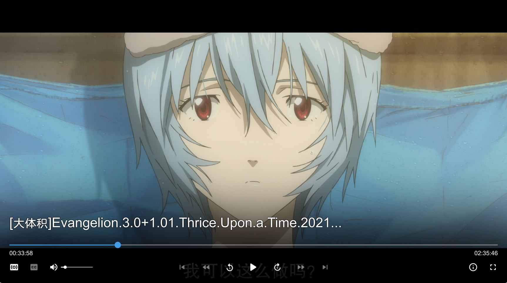

# ModernX
A fork of mpvX (based on [mpv-osc-modern](https://github.com/maoiscat/mpv-osc-modern/)), that aims to mirror the functionality of MPV's stock OSC while with a more modern-looking interface.



> [!NOTE]
> This script is included in my [mpvconfig](https://github.com/zydezu/mpvconfig), check that repository for a full mpv configuration

# Additional Features
This fork changes the following:
- Adds compact mode and reorganises some features
- Added loop and pin window buttons
- Adds a download button for web videos
- Displays descriptions, likes and dislike counts from web videos
- Added shift+left clicking and shift+right clicking the audio/subtitles button for a list of tracks are shown and traversed through
- Pressing TAB shows a list of chapters
- Added dynamic title changing depending on the file/source being played
- Many more configurable options
- Various bug fixes

# Installation

Locate your MPV folder. It is typically located at `\%APPDATA%\mpv\` on Windows and `~/.config/mpv/` on Linux/MacOS. See the [Files section](https://mpv.io/manual/master/#files) in mpv's manual for more info.

> [!NOTE]
> Create these folders if you don't have them already

Place `modernx.lua` into your mpv `scripts/` folder, remove any previous OSC scripts.

Then place the two fonts in the `fonts/` folder. `Material-Design-Iconic-Font.ttf` can be downloaded [Material-Design-Iconic-Font.ttf](Material-Design-Iconic-Font.ttf) and `Material-Design-Iconic-Round.ttf` also [Material-Design-Iconic-Round.ttf](Material-Design-Iconic-Round.ttf).


### mpv.conf
Add the following lines to your `mpv.conf` file.
```editorconfig
osc=no
border=no #optional - if you don't want to see the OS border
```


### Border differences

This is what disabling and enabling the border looks like:

| Border Enabled | Border Disabled |
| -------------- | --------------- |
|  |  |

> [!NOTE]
> This option may vary depending on your system.

# Configuration

Create an `modernx.conf` file and place it in the `script-opts/` folder (create the folder if you haven't already). A plethora of options can be changed, so please refer to the table of configurable `user_opts` parameters below for detailed explanations of settings.


### Example

Here is an example of a configuration file, which would be placed in `script-opts/modernx.conf`:

```editorconfig
compactmode=no
showinfo=yes
titlefontsize=20
seekbarhandlesize=0
```

### Configurable Options

| Option   | Description |
| -------------- | --------------- |
| language | The language of the osc, mostly messages that are shown in the top left of the screen <br>  |
| welcomescreen  | Whether to show the mpv 'Drop files or URLs to play here.' screen <br>  |
| windowcontrols | Whether to show OSC window controls, 'auto' will only show them in fullscreen or when borderless, 'yes' always shows them and 'no' never shows them |
| showwindowed | Whether to show the OSC when windowed |
| showfullscreen | Whether to show the OSC when in fullscreen |
| noxmas | Disable showing the santa hat in December |
| vidscale | Whether the OSC scales with the window's size |
| scalewindowed  | The scaling of the OSC when windowed |
| scalefullscreen | The scaling of the OSC when in fullscreen |
| scaleforcedwindow | The scaling when rendered on a forced window (like an audio file) |
| hidetimeout | Duration in ms until the OSC hides when there is no mouse movement |
| fadeduration | Duration in ms of the fade effect the OSC exihibts |
| minmousemove | The minimum amount of pixels the mouse has to move for the OSC to show |
| showonpause | Whether to disable the hide timeout on pause (when enabled, pausing will show the OSC instantly) |
| bottomhover | If the osc should only display when hovering over UI elements at the bottom of the window (includes the window control buttons at the top if visible) <br> **On:** <br>  <br> **Off:** <br>  |
| raisesubswithosc | Whether to raise any subtitles being shown, if the OSC is being shown <br>  |
| thumbnailborder | The width of outline of the [thumbnail border](thumbnails) |
| showtitle | Whether to show the title in the OSC |
| showdescription | Whether to show video description on web videos, clicking it will show an on-screen box of the full description <br>  |
| showwindowtitle | Whether to show to window title, when the window is borderless/fullscreened (this will match whatever is set in your `mpv.conf` file) <br>  |
| titleBarStrip | Whether to make the title bar a singular bar, instead of a black fade at the top of the screen |
| dynamictitle | Changed what title information is shown depending on if the `filename` and `media-title` properties differ, seen most in audio files and playing urls |
| font | The font of the OSC, by default matches the font set in `mpv.conf` |
| title | What title is shown in the OSC, see the [mpv manual](https://mpv.io/manual/master/#command-interface-media-title) for more properties |
| titlefontsize | The size of the title text |
| chapter_fmt | The format of the chapter text when hovering over the seekbar. Use 'no' to disable |
| dateformat | how dates should be formatted, when read from metadata (uses standard lua date formatting) <br>  |
| osc_color | The colour of the OSC and title bar |
| OSCfadealpha | Alpha of the background box for the OSC |
| boxalpha | Alpha of the fade box effect, 0 (opaque) to 255 (fully transparent) |
| descriptionBoxAlpha | Alpha of the description background box |
| seekbarfg_color | Colour of current seekbar progress and the handle
| seekbarbg_color | Colour of the remaining seekbar
| seekbarkeyframes | Whether to use keyframes when dragging the seekbar |
| seekbarhandlesize | How big the seek bar handle appears, from 0 to 1 |
| seekrange | Whether to show the buffer range on the seekbar |
| seekrangealpha | The transparency of seekranges |
| iconstyle | Whether the icons are normal or round varients - thanks to [https://github.com/cyl0/ModernX/pull/55](https://github.com/cyl0/ModernX/pull/55) |
| hovereffect | Whether buttons emit a glowing effect when hovered over
| timetotal | Whether to display the total time instead of remaining time |
| timems | Whether to display time in milliseconds |
| timefontsize | The font size of the time |
| jumpamount | How many seconds the jump buttons jump by |
| jumpiconnumber | Whether to show 5, 10 or 30 in the jump icons if the `jumpamount` are any of those values |
| jumpmode | What kind of seeking mode is used for the jump buttons |
| volumecontrol | Whether to show the mute button and volume slider |
| volumecontroltype | Whether to use linear or logarithmic volume scale |
| showjump | Whether to show the jump forward/backward buttons |
| showskip | Whether to show the chapter buttons |
| compactmode | Remove the 'jump' buttons and embed that functionality in the 'chapter' buttons, see [compact mode](https://github.com/zydezu/ModernX#compact-mode) for more information |
| showloop | Whether to show the loop button |
| loopinpause | Whether to activate looping by right clicking pause |
| showontop | Whether to show the pin window on top button |
| showinfo | Whether to show the info button |
| downloadbutton | Whether to show download button for web videos |
| ytdlpQuality | What quality of video the download button uses (a max quality mp4 by is downloaded by default) |


The default options are shown below:

```lua
-- Parameters
-- default user option values
-- may change them in osc.conf
local user_opts = {
    -- general settings --
    language = 'en',		        -- en:English, chs:Chinese, pl:Polish, jp:Japanese
    welcomescreen = true,           -- show the mpv 'play files' screen upon open
    windowcontrols = 'auto',        -- whether to show OSC window controls, 'auto', 'yes' or 'no'
    showwindowed = true,            -- show OSC when windowed?
    showfullscreen = true,          -- show OSC when fullscreen?
    noxmas = false,                 -- disable santa hat in December
    
    -- scaling settings --
    vidscale = false,               -- whether to scale the controller with the video
    scalewindowed = 1.0,            -- scaling of the controller when windowed
    scalefullscreen = 1.0,          -- scaling of the controller when fullscreen
    scaleforcedwindow = 1.0,        -- scaling when rendered on a forced window

    -- interface settings --
    hidetimeout = 1500,             -- duration in ms until OSC hides if no mouse movement
    fadeduration = 150,             -- duration of fade out in ms, 0 = no fade
    minmousemove = 0,               -- amount of pixels the mouse has to move for OSC to show
    scrollingSpeed = 40,            -- the speed of scrolling text in menus
    showonpause = true,             -- whether to disable the hide timeout on pause
    bottomhover = true,             -- if the osc should only display when hovering at the bottom
    raisesubswithosc = true,        -- whether to raise subtitles above the osc when it's shown
    thumbnailborder = 2,            -- the width of the thumbnail border

    -- title and chapter settings --
    showtitle = true,		        -- show title in OSC
    showdescription = true,         -- show video description on web videos
    showwindowtitle = true,         -- show window title in borderless/fullscreen mode
    titleBarStrip = true,           -- whether to make the title bar a singular bar instead of a black fade
    dynamictitle = true,            -- change the title depending on if {media-title} and {filename} 
                                    -- differ (like with playing urls, audio or some media)
    font = 'mpv-osd-symbols',	    -- default osc font
    title = '${media-title}',       -- string compatible with property-expansion
                                    -- to be shown as OSC title
    titlefontsize = 28,             -- the font size of the title text
    chapter_fmt = 'Chapter: %s',    -- chapter print format for seekbar-hover. "no" to disable
    dateformat = "%Y-%m-%d",        -- how dates should be formatted, when read from metadata
                                    -- (uses standard lua date formatting)
    osc_color = '000000',           -- accent of the OSC and the title bar
    OSCfadealpha = 150,             -- alpha of the background box for the OSC
    boxalpha = 75,                  -- alpha of the window title bar
    descriptionBoxAlpha = 100,      -- alpha of the description background box

    -- seekbar settings --
    seekbarfg_color = 'E39C42',     -- color of the seekbar progress and handle
    seekbarbg_color = 'FFFFFF',     -- color of the remaining seekbar
    seekbarkeyframes = false,       -- use keyframes when dragging the seekbar
    seekbarhandlesize = 0.8,	    -- size ratio of the slider handle, range 0 ~ 1
    seekrange = true,		        -- show seekrange overlay
    seekrangealpha = 150,      	    -- transparency of seekranges
    iconstyle = 'round',            -- icon style, 'solid' or 'round'
    hovereffect = true,             -- whether buttons have a glowing effect when hovered over

    -- button settings --
    timetotal = true,          	    -- display total time instead of remaining time?
    timems = false,                 -- show time as milliseconds by default
    jumpamount = 5,                 -- change the jump amount (in seconds by default)
    jumpiconnumber = true,          -- show different icon when jumpamount is 5, 10, or 30
    jumpmode = 'exact',             -- seek mode for jump buttons. e.g.
                                    -- 'exact', 'relative+keyframes', etc.
    volumecontrol = true,           -- whether to show mute button and volume slider
    volumecontroltype = 'linear',   -- use linear or logarithmic volume scale
    showjump = true,                -- show "jump forward/backward 5 seconds" buttons 
                                    -- shift+left-click to step 1 frame and 
                                    -- right-click to jump 1 minute
    showskip = true,                -- show the skip back and forward (chapter) buttons
    compactmode = true,             -- replace the jump buttons with the chapter buttons, clicking the
                                    -- buttons will act as jumping, and shift clicking will act as
                                    -- skipping a chapter
    showloop = false,               -- show the loop button
    loopinpause = true,             -- activate looping by right clicking pause
    showontop = true,               -- show window on top button
    showinfo = false,               -- show the info button
    downloadbutton = true,          -- show download button for web videos
    ytdlpQuality = "-S res,ext:mp4:m4a" -- what quality of video the download button uses (max quality mp4 by default)
}}
```

### Compact Mode

Compact mode is a setting you can enable in the configuration, it removes the skip buttons, and places that functionality within the chapter buttons, allowing for more space in the interface. Clicking the buttons will act as jumping, and shift clicking will act as skipping a chapter

| Compact Mode Enabled | Compact Mode Disabled |
| -------------- | --------------- |
|  |  |


> [!IMPORTANT]
> This changes the actions of the chapter back/forward buttons in the following way:
> * `Left mouse button` jumps forwards/backwards by 5 seconds, or by the amount set in `user_opts`
> * `Right mouse button` play previous/next chapter and show the chapter list
> * `Shift + Left mouse button` jumps forwards/backwards by 1 minute
> * `Shift + Right mouse button` show playlist
> Please note that this option will override the `showjump` option.

### Thumbnails

To enable thumbnails on the seekbar, install [thumbfast](https://github.com/po5/thumbfast). No other step necessary.


# Buttons

Like the built-in script, some buttons may accept multiple mouse actions, here is a list:

> [!NOTE]
> Middle clicking performs the same function as Shift + Left Clicking, allowing for one handed use

### Title
* `Left mouse button` show the full media title
* `Right mouse button` show the full filename
### Description (only on web videos)
* `Left mouse button` show the full description, use `up arrow`, `down arrow` or `scroll wheel` to scroll through it
### Seekbar
* `Left mouse button` seek to chosen position
* `Right mouse button` seek to the head of chosen chapter
### Playback time
* `Left mouse button` display time in milliseconds
### Duration
* `Left mouse button` display total time instead of remaining time
### Playlist back/forward buttons
* `Left mouse button` play previous/next file
* `Right mouse button` show playlist
* `Shift + Left mouse button` play previous/next file and show playlist
* `Shift + Right mouse button` show playlist
### Skip back/forward buttons
* `Left mouse button` go to previous/next chapter
* `Right mouse button` show chapter list
* `Shift + Left mouse button` go to previous/next chapter and show playlist
* `Shift + Right mouse button` show chapter list
### Jump back/forward buttons
* `Left mouse button` jumps forwards/backwards by 5 seconds, or by the amount set in `user_opts`
* `Right mouse button` jumps forwards/backwards by 1 minute
* `Shift + Left mouse button` skips to the previous/next frame
### Audio/subtitle track buttons
* `Left mouse button/Right mouse button` cycle to next/previous track
* `Shift + Left mouse button` cycle to next/previous track and show track list
* `Shift + Right mouse button` show track list
### Pin button
* `Left mouse button` toggle pinning (and removing video border)
* `Right mouse button` toggle pinning without changing the border
### Volume
* `Left mouse button` mute/unmute video
* `Scroll wheel` change volume
### Other
* `X` cycle through audio tracks
* `C` cycle through subtitle tracks
* `P` pin or unpin the window
* `TAB` show chapter list
* `CTRL/Shift + Left` jump to the previous chapter
* `CTRL/Shift + Right` jump to the next chapter